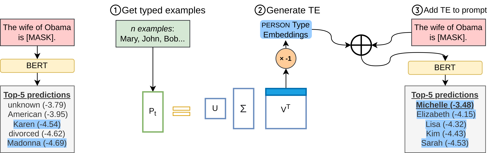

# You Are My Type! Type Embeddings for Pre-trained Language Models @ EMNLP 2022 (Findings)
[(Paper)](https://www.eurecom.fr/publication/7095/download/data-publi-7095.pdf) 


One reason for the positive impact of Pretrained Language Models (PLMs) in NLP tasks is their ability to encode semantic types, such
as ‘European City’ or ‘Woman’. While previous work has analyzed such information in the context of interpretability, it is not clear how to use types to steer the PLM output. For example, in a cloze statement, it is desirable to steer the model to generate a token that satisfies a user-specified type, e.g., predict a date rather than a location. 

In this work, we introduce Type Embeddings (TEs), an input embedding that promotes desired types in a PLM. Our proposal is to define a type by a small set of word examples. We empirically study the ability of TEs both in representing types and in steering masking  redictions without changes to the prompt text in BERT. Finally, using the LAMA datasets, we show how TEs highly improve the precision in extracting facts from PLMs.

This repo contains the required code for running the experiments of the associated paper.


## I. Installation
### 0. Clone Repo
```bash
git clone https://github.com/MhmdSaiid/TypeEmbedding
cd TypeEmbedding
```

### 1. Create virtual env and install reqs

```bash
virtualenv TE -p $(which python3)
source TE/bin/activate
pip install -r requirements.txt
```

### 2. Unzip Data
The datasets and type embeddings used for the experiments:

```bash
bash exps/prepare_data.sh
```


## II. TE Analysis
* Similarity [(exps/Similarity.ipynb)](exps/Similarity.ipynb)
* SV distribution [(exps/Type_Eigen_Analysys.ipynb)](exps/Type_Eigen_Analysys.ipynb)
* Adversarial metrics
    *    Adversarial Accuracy
                ```
                bash exps/PushTest.sh
                ```
    *    Adversarial Sensitivity
                ```
                bash exps/SensTest.sh
                ```
* Layerwise Classification
        ```
        bash exps/LayerwiseTest.sh
        ```
* TCAV Sensitivty [(exps/LW_TCAV.ipynb)](exps/LW_TCAV.ipynb)


## III. TE MLM Experiments

* Instrinsic Experiments (Section X.X)
    ```bash
    bash exps/runItr.sh
    python src/print_avg.py --res_dir "results/ProcessedDatasets" 
    ```

* Run Extrinsic Experiments (Section X.X)
    ```bash
    ```
* Type Switch [(exps/Type_Switch.ipynb)](exps/Type_Switch.ipynb)

* Sampling Variations
    * Sampling Method ```bash exps/SampleMethod.sh```
    *  Number of Samples ```bash exps/SampleNum.sh```


## IV. TE NLG Experiments

* GPT-2 examples [(exps/GPT2+Concept.ipynb)](exps/GPT2+Concept.ipynb)

* De-toxification


## V. Generate Your Own Type Embedding
You can generate your own Type Embeddings using the following script:
```bash
python src/GetTypeVecs.py --model_arch 'bert-base-cased'\
                          --path 'data/KG Samples/'\
                          --seed 0\ 
                          --num_samples 10
```
* `--model_arch`: model architecture according to HuggingFace's Transformers library
* `--path`: folder containing samples for types in csv format
* `--seed`: seed calue for reproducability
* `--num_samples`: number of samples used
* `--sample_type`: Sampling Method. Choose between Random Sampling (Rand), Random Weighted Sampling (Weighted), Most important samples (Top), and Least important sample (Bot)


## Contact Us
For any inquiries, feel free to [contact us](mailto:saeedm@eurecom.fr), or raise an issue on Github.


## Reference
You can cite our work:

```
@inproceedings{saeed-etal-2022-TE,
  title = {You Are My Type! Type Embeddings for Pre-trained Language Models},
  author = {Saeed, Mohammed and Papotti, Paolo},
  booktitle = {Proceedings of the 2022 Conference on Empirical Methods in Natural Language Processing},
  month = dec,
  year = {2022},
  address = {Online and Abu Dhabi, UAE},
  publisher = {Association for Computational Linguistics},
}
```

